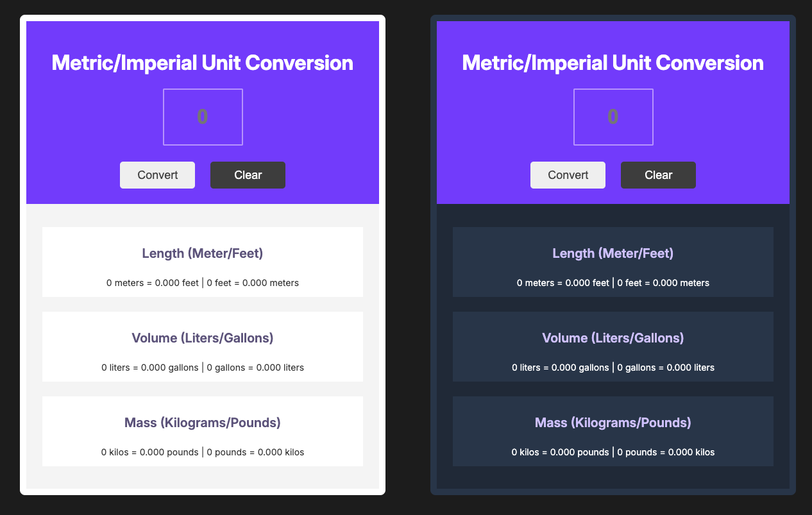
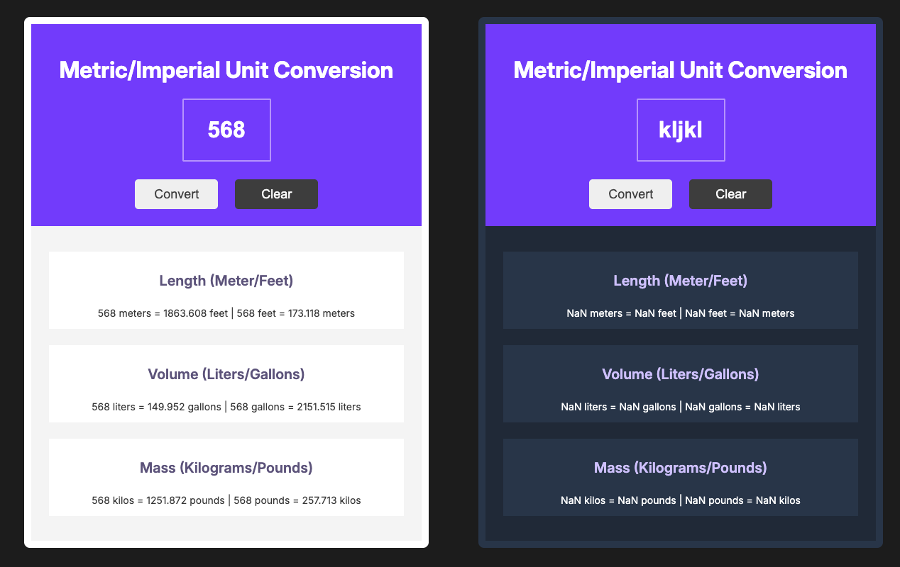
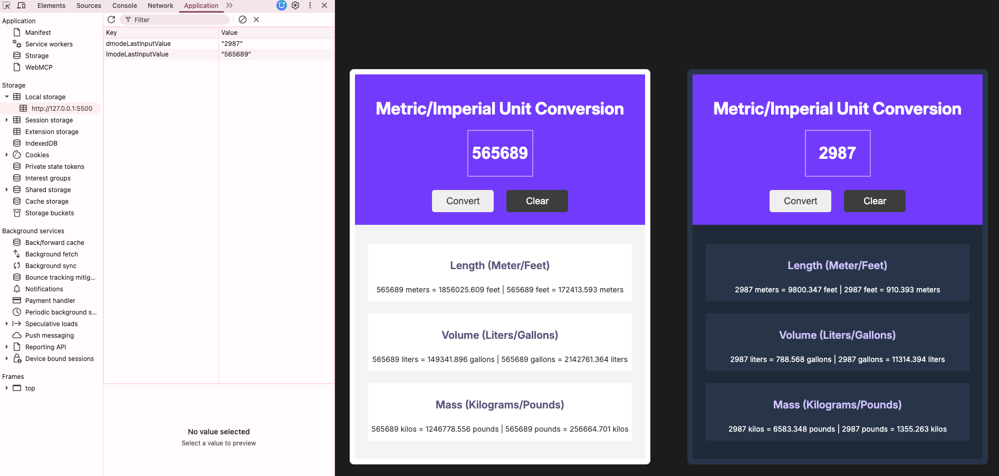

# 📏 Unit Converter

A simple unit converter that converts between metric and imperial units for length, volume, and mass.

---

## 📸 Preview

---

## ✨ Features

- Convert meters ↔ feet
- Convert liters ↔ gallons
- Convert kilograms ↔ pounds
- Light and Dark layouts
- Remembers the last entered value using Local Storage
- Automatically restores the last value after page refresh
- Automatically recalculates conversions after page refresh
- Double-click Clear button to clear the saved value
- Input placeholder for better usability

---

## 🛠️ Built With

- HTML5
- CSS3
- Vanilla JavaScript
- Flexbox
- CSS Variables
- Figma

---

## 💡 JavaScript Concepts Used

- Variables (`const`)
- Functions
- DOM selection (`getElementById`)
- Event handling (`addEventListener`, `click`, `dblclick`)
- DOM manipulation (`innerHTML`)
- Template literals
- Number conversion (`Number()`)
- Decimal formatting (`toFixed()`)
- Mathematical calculations
- Local Storage API
- `JSON.stringify()`
- `JSON.parse()`

> **Note:** `JSON.stringify()` and `JSON.parse()` are intentionally used for revision purposes. Although Local Storage stores strings directly, this pattern is required when storing objects or arrays.

---

## 📚 What I Learned

While building this project, I practiced:

- Writing reusable JavaScript functions for unit conversions
- Performing mathematical calculations and formatting results using `toFixed()`
- Converting user input into numeric values with `Number()`
- Updating the DOM dynamically based on user interactions
- Handling button click events with `addEventListener()`
- Rendering dynamic content using template literals
- Implementing Light and Dark themes using CSS variables
- Translating a Figma design into a responsive and functional web application
- Persisting data using the Local Storage API
- Using `JSON.stringify()` and `JSON.parse()` for storing and retrieving data

---

## 🎯 Project Goal

Strengthen JavaScript fundamentals by building a unit conversion application with Light and Dark layouts that performs real-time calculations, updates the DOM dynamically, persists data using Local Storage, and restores the previous application state after a page refresh.

---

## 👨‍💻 Author

**Ashish Bargaje**

- GitHub: https://github.com/ashishbargaje
- LinkedIn: https://www.linkedin.com/in/ashish-bargaje/